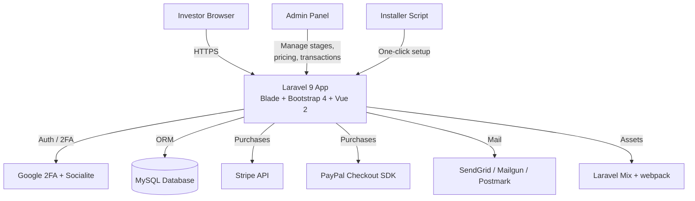

<p align="center">
  
</p>

<p align="center">
  
  
  
  
  
  
  
  
</p>

> **Developed by [Arslan Malik](https://github.com/arsalanmaalik461)**
> 📱 WhatsApp: [+92 300 8987448](https://wa.me/923008987448) · 🌐 Website: [arslanmalik.tech](https://arslanmalik.tech)

---

## 🌟 Executive Overview

**Token Sale Management** is a complete, production-ready ICO / token sale platform built on Laravel 9. It gives a project everything needed to run a public or private token sale end to end: investors register and manage KYC-style accounts, browse the live sale, and purchase tokens through integrated **Stripe** and **PayPal Checkout** payment gateways. The built-in referral system with QR code generation helps the sale spread organically, while **Google 2FA** two-factor authentication keeps investor accounts protected.

Behind the scenes, a full-featured admin panel puts the operator in control of every lever of the sale — defining sale stages and tiers, setting token pricing, reviewing transactions, and managing investors. Email notifications ship with multiple drivers (SendGrid, Mailgun, Postmark) so buyers and admins stay informed at every step, and a one-click web installer plus bundled HTML documentation (installation, admin, and user guides with a changelog) make deployment and onboarding straightforward.

---

## 📑 Table of Contents

- [✨ Key Features & Highlights](#-key-features--highlights)
- [🖥️ Feature Showcase](#️-feature-showcase)
- [🏗️ System Architecture](#️-system-architecture)
- [🚀 Quickstart & Installation Guide](#-quickstart--installation-guide)
- [📂 Project Structure](#-project-structure)
- [🛡️ Security & Notes](#️-security--notes)

---

## ✨ Key Features & Highlights

| Feature | Description |
| :--- | :--- |
| 👥 Investor Accounts | Registration, login, profile and KYC-style account management for sale participants |
| 💳 Token Purchases | Full token purchase flow with Stripe and PayPal Checkout SDK integrations |
| 🔐 Google 2FA | Two-factor authentication on investor accounts via Google Authenticator |
| 📣 Referral & QR Codes | Referral system with auto-generated QR codes to grow the sale through word of mouth |
| 🧭 Admin Dashboard | Manage sale stages, token pricing, investors and transactions from one panel |
| 📧 Email Notifications | Transactional emails via SendGrid, Mailgun or Postmark mail drivers |
| ⚙️ One-Click Installer | Web-based installer script for fast, guided deployment |
| 📚 Bundled Documentation | Ship-ready HTML docs: installation, admin guide, user guide, troubleshooting, changelog |
| 🧪 Tested with PHPUnit | Test suite structure in place for the Laravel codebase |

---

## 🖥️ Feature Showcase

### 1. Investor Portal

> *"Onboard investors in minutes with secure accounts and a clean purchase flow."*

- Self-service registration and account dashboard
- KYC-style profile management for investor records
- Optional Google 2FA for extra account security
- Social login support via Laravel Socialite

### 2. Token Purchase & Payment Gateways

> *"Sell tokens through the payment rails your investors already trust."*

- Real-time token pricing pulled from the configured sale stage
- Stripe payment integration for card purchases
- PayPal Checkout SDK for PayPal-based purchases
- Transaction records stored per purchase for full auditability

### 3. Referral Growth System

> *"Turn every investor into a promoter with shareable referral QR codes."*

- Unique referral codes generated per investor
- QR code images for sharing on social or print
- Referral attribution tracked in the database

### 4. Admin Control Panel

> *"Run the whole sale — stages, pricing, transactions — from one dashboard."*

- Define and schedule token sale stages/tiers
- Set and update token pricing per stage
- Review investor accounts and transaction history
- Broadcast email notifications to participants

---

## 🏗️ System Architecture



---

## 🚀 Quickstart & Installation Guide

### Prerequisites

- PHP 8.1 or higher with required Laravel extensions
- Composer 2.x
- MySQL 5.7+ / 8.x
- Node.js & NPM/Yarn (for compiling frontend assets)
- Stripe and PayPal API credentials for live payments

### Step-by-Step Installation

```bash
git clone https://github.com/arsalanmaalik461/Token-Sale-Management.git
cd Token-Sale-Management

composer install
cp .env.example .env
php artisan key:generate
```

Open `.env` and set your database credentials, `APP_URL`, mail driver (SendGrid / Mailgun / Postmark), and Stripe/PayPal keys, then:

```bash
php artisan migrate --seed
npm install && npm run production
php artisan serve
```

Visit [http://localhost:8000](http://localhost:8000) in your browser. Alternatively, drop the project on a web server and use the built-in web installer (`installed` flag file present in the repo) for guided setup, and import `dummy_app.sql` if you need the sample database.

### Running Tests

```bash
vendor/bin/phpunit
```

---

## 📂 Project Structure

```
Token-Sale-Management/
├── app/                # Laravel application: controllers, models, middleware
├── bootstrap/          # Application bootstrap and cached config
├── config/             # Configuration files (app, mail, services, gateways)
├── database/           # Migrations, seeders and factories
├── documentation/      # Bundled HTML docs (installation, admin, user, changelog)
├── lang/               # Localization files
├── public/             # Web root: index entry, compiled assets
├── resources/          # Blade views, raw JS/SCSS, Vue components
├── routes/             # Web and API route definitions
├── storage/            # Logs, cache, uploads
├── tests/              # PHPUnit test suite
├── artisan             # Artisan CLI entry point
├── composer.json       # PHP dependencies (Laravel 9, Socialite, 2FA, etc.)
├── package.json        # Frontend deps: Bootstrap 4, Vue 2, Laravel Mix 4
├── webpack.mix.js      # Asset build configuration
├── .env.example        # Environment template (DB, mail, gateway keys)
├── dummy_app.sql       # Sample database dump
└── server.php          # PHP dev-server router
```

---

## 🛡️ Security & Notes

- **Never commit real credentials:** keep `.env` out of version control — the repo ships `.env.example` as a template for Stripe, PayPal, mail and database keys.
- **Google 2FA is enabled for investor accounts** — make sure the app encryption key (`APP_KEY`) is generated and kept secret, since it protects 2FA secrets at rest.
- **Payment webhooks:** configure Stripe/PayPal webhook endpoints and signing secrets in production before accepting real purchases, and serve the app over HTTPS.
- **Installer lock:** remove or secure the web installer route after first setup so it cannot be re-run by visitors.
- **Database backups:** `dummy_app.sql` is sample data only — set up regular `mysqldump` backups for the live sale database.
- **Stay updated:** run `composer update` and `npm audit` periodically to pick up security fixes in dependencies.

---

<p align="center">
  <sub>Developed with ❤️ by <a href="https://github.com/arsalanmaalik461">Arslan Malik</a> · 📱 <a href="https://wa.me/923008987448">WhatsApp: +92 300 8987448</a> · 🌐 <a href="https://arslanmalik.tech">arslanmalik.tech</a></sub>
</p>
